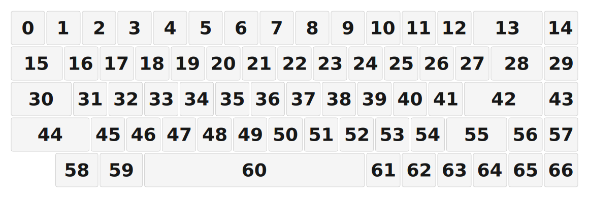

# ZMK Configuration for firstkb

*Generated by Shield Wizard for ZMK*



Download compiled firmware from the Actions tab. <https://zmk.dev/docs/user-setup#installing-the-firmware>

Edit your keymap <https://zmk.dev/docs/keymaps>.
User keymap is located at [`config/firstkb.keymap`](config/firstkb.keymap).

-----

<details>
<summary>
Shield Wizard Debug Information
</summary>

In case of broken configuration, here is the Shield Wizard internal data used to generate this configuration:

Commit: 63ab9b7bd8845252979f45da72f40210b0b1a3ae

```json
{"name":"firstkb","shield":"firstkb","dongle":false,"modules":[],"layout":[{"id":"01KTPM5C2FDM32XQ3VS6Z65CMW","part":0,"row":0,"col":0,"w":1,"h":1,"x":0,"y":0,"r":0,"rx":0,"ry":0},{"id":"01KTPM5DDF02WFGDG6CR6HXNEH","part":0,"row":0,"col":1,"w":1,"h":1,"x":1,"y":0,"r":0,"rx":0,"ry":0},{"id":"01KTPM5DK8ZHBAG02F9VTF8207","part":0,"row":0,"col":2,"w":1,"h":1,"x":2,"y":0,"r":0,"rx":0,"ry":0},{"id":"01KTPM5DRBG0PSEPH7M2FA11HC","part":0,"row":0,"col":3,"w":1,"h":1,"x":3,"y":0,"r":0,"rx":0,"ry":0},{"id":"01KTPM5DXQN704YF8HN2ZX4TEA","part":0,"row":0,"col":4,"w":1,"h":1,"x":4,"y":0,"r":0,"rx":0,"ry":0},{"id":"01KTPM5E34T2GW1MGFY1N6HTHM","part":0,"row":0,"col":5,"w":1,"h":1,"x":5,"y":0,"r":0,"rx":0,"ry":0},{"id":"01KTPM5E8N9F5MRK2B64WFT406","part":0,"row":0,"col":6,"w":1,"h":1,"x":6,"y":0,"r":0,"rx":0,"ry":0},{"id":"01KTPM5EEJVF80K73T8VYCDEZK","part":0,"row":0,"col":7,"w":1,"h":1,"x":7,"y":0,"r":0,"rx":0,"ry":0},{"id":"01KTPM5EMFBGZ682R2HDWW9AYF","part":0,"row":0,"col":8,"w":1,"h":1,"x":8,"y":0,"r":0,"rx":0,"ry":0},{"id":"01KTPM5ET3SXCGBQCQ94KT0364","part":0,"row":0,"col":9,"w":1,"h":1,"x":9,"y":0,"r":0,"rx":0,"ry":0},{"id":"01KTPM5F05X66B7M64N8JZCWYD","part":0,"row":0,"col":10,"w":1,"h":1,"x":10,"y":0,"r":0,"rx":0,"ry":0},{"id":"01KTPM5F66FE1HHXX4QJAM7S3T","part":0,"row":0,"col":11,"w":1,"h":1,"x":11,"y":0,"r":0,"rx":0,"ry":0},{"id":"01KTPM5FBSN8SBNWJJS9JQ05PV","part":0,"row":0,"col":12,"w":1,"h":1,"x":12,"y":0,"r":0,"rx":0,"ry":0},{"id":"01KTPM5GC90GPJ5433ATA64KEJ","part":0,"row":0,"col":14,"w":2,"h":1,"x":13,"y":0,"r":0,"rx":0,"ry":0},{"id":"01KTPM638YPN00C9JQSHMJZ0Q5","part":0,"row":0,"col":15,"w":1,"h":1,"x":15,"y":0,"r":0,"rx":0,"ry":0},{"id":"01KTPM6HTDWKCAQEKA03SHDNBZ","part":0,"row":0,"col":16,"w":1.5,"h":1,"x":0,"y":1,"r":0,"rx":0,"ry":0},{"id":"01KTPM78S2S0RAJ3JKGH70HTQN","part":0,"row":0,"col":17,"w":1,"h":1,"x":1.5,"y":1,"r":0,"rx":0,"ry":0},{"id":"01KTPM78Y682VRKVHKG65F6M7P","part":0,"row":0,"col":18,"w":1,"h":1,"x":2.5,"y":1,"r":0,"rx":0,"ry":0},{"id":"01KTPM793BJZGJZMTN52QWCST1","part":0,"row":0,"col":19,"w":1,"h":1,"x":3.5,"y":1,"r":0,"rx":0,"ry":0},{"id":"01KTPM799QFQFA8R1T700W4BDJ","part":0,"row":0,"col":20,"w":1,"h":1,"x":4.5,"y":1,"r":0,"rx":0,"ry":0},{"id":"01KTPM7CBVCFB7NATW2ZYAS7MC","part":0,"row":0,"col":21,"w":1,"h":1,"x":5.5,"y":1,"r":0,"rx":0,"ry":0},{"id":"01KTPM7CH4AP6SBXKN024FP45X","part":0,"row":0,"col":22,"w":1,"h":1,"x":6.5,"y":1,"r":0,"rx":0,"ry":0},{"id":"01KTPM7CQD9W0CBWFHZ7BW5MAD","part":0,"row":0,"col":23,"w":1,"h":1,"x":7.5,"y":1,"r":0,"rx":0,"ry":0},{"id":"01KTPM7CX90HRXC9NEJTF2YGTY","part":0,"row":0,"col":24,"w":1,"h":1,"x":8.5,"y":1,"r":0,"rx":0,"ry":0},{"id":"01KTPM7D3DM78502T7BRPH258R","part":0,"row":0,"col":25,"w":1,"h":1,"x":9.5,"y":1,"r":0,"rx":0,"ry":0},{"id":"01KTPM7D9JCMSZ5Y8PXE8GAG3J","part":0,"row":0,"col":26,"w":1,"h":1,"x":10.5,"y":1,"r":0,"rx":0,"ry":0},{"id":"01KTPM7DFEAK0SW3T4RBKFM282","part":0,"row":0,"col":27,"w":1,"h":1,"x":11.5,"y":1,"r":0,"rx":0,"ry":0},{"id":"01KTPM7DNASFT1QQQMJAXGNNGP","part":0,"row":0,"col":28,"w":1,"h":1,"x":12.5,"y":1,"r":0,"rx":0,"ry":0},{"id":"01KTPM7XT6R8B5AEAC4H9CJS7T","part":0,"row":0,"col":30,"w":1.5,"h":1,"x":13.5,"y":1,"r":0,"rx":0,"ry":0},{"id":"01KTPM7YGH7C03ZGHG77CWPBHM","part":0,"row":0,"col":31,"w":1,"h":1,"x":15,"y":1,"r":0,"rx":0,"ry":0},{"id":"01KTPMAQYEATBESA1KTZBWE0FY","part":0,"row":0,"col":32,"w":1.75,"h":1,"x":0,"y":2,"r":0,"rx":0,"ry":0},{"id":"01KTPMB7DCF52MG4378M5VM83S","part":0,"row":0,"col":33,"w":1,"h":1,"x":1.75,"y":2,"r":0,"rx":0,"ry":0},{"id":"01KTPMB7M56NJ0NB6KMW8TCQX6","part":0,"row":0,"col":34,"w":1,"h":1,"x":2.75,"y":2,"r":0,"rx":0,"ry":0},{"id":"01KTPMB7WH6RN35Q0724QD6N1F","part":0,"row":0,"col":35,"w":1,"h":1,"x":3.75,"y":2,"r":0,"rx":0,"ry":0},{"id":"01KTPMB8BSN32K2YSGA0ESPP4P","part":0,"row":0,"col":36,"w":1,"h":1,"x":4.75,"y":2,"r":0,"rx":0,"ry":0},{"id":"01KTPMB8PA2NG9YTMXM8HR54AX","part":0,"row":0,"col":37,"w":1,"h":1,"x":5.75,"y":2,"r":0,"rx":0,"ry":0},{"id":"01KTPMB90W520432B4ZBB59CD2","part":0,"row":0,"col":38,"w":1,"h":1,"x":6.75,"y":2,"r":0,"rx":0,"ry":0},{"id":"01KTPMB9ADNJWYTFXME71N145C","part":0,"row":0,"col":39,"w":1,"h":1,"x":7.75,"y":2,"r":0,"rx":0,"ry":0},{"id":"01KTPMB9M6D00HC3DVKP6YZM8C","part":0,"row":0,"col":40,"w":1,"h":1,"x":8.75,"y":2,"r":0,"rx":0,"ry":0},{"id":"01KTPMB9XH2GX1SRKY3AY2BJ4P","part":0,"row":0,"col":41,"w":1,"h":1,"x":9.75,"y":2,"r":0,"rx":0,"ry":0},{"id":"01KTPMBA7RBME08JJEQAKKSJGK","part":0,"row":0,"col":42,"w":1,"h":1,"x":10.75,"y":2,"r":0,"rx":0,"ry":0},{"id":"01KTPMBAJAY74R9CA1RKFDBCRA","part":0,"row":0,"col":43,"w":1,"h":1,"x":11.75,"y":2,"r":0,"rx":0,"ry":0},{"id":"01KTPMBB774FD8JEA1BX2DWP7H","part":0,"row":0,"col":45,"w":2.25,"h":1,"x":12.75,"y":2,"r":0,"rx":0,"ry":0},{"id":"01KTPMKABH4VP0FAKWH7PFD95X","part":0,"row":0,"col":46,"w":1,"h":1,"x":15,"y":2,"r":0,"rx":0,"ry":0},{"id":"01KTPMKFQYS6KM798WN6BKGHXQ","part":0,"row":0,"col":47,"w":2.25,"h":1,"x":0,"y":3,"r":0,"rx":0,"ry":0},{"id":"01KTPMKG7HKFXJEN425JNS24EE","part":0,"row":0,"col":48,"w":1,"h":1,"x":2.25,"y":3,"r":0,"rx":0,"ry":0},{"id":"01KTPMKGSP5VT86E1MWZ2VQG1Y","part":0,"row":0,"col":49,"w":1,"h":1,"x":3.25,"y":3,"r":0,"rx":0,"ry":0},{"id":"01KTPMKHAJB8GNTVF9XPSD5493","part":0,"row":0,"col":50,"w":1,"h":1,"x":4.25,"y":3,"r":0,"rx":0,"ry":0},{"id":"01KTPMKHWQJ3SBKC6PV05EHHJF","part":0,"row":0,"col":51,"w":1,"h":1,"x":5.25,"y":3,"r":0,"rx":0,"ry":0},{"id":"01KTPMKJ4A56MVQJZBK2J6WDTN","part":0,"row":0,"col":52,"w":1,"h":1,"x":6.25,"y":3,"r":0,"rx":0,"ry":0},{"id":"01KTPMKJA77FD8DK8589T33V4S","part":0,"row":0,"col":53,"w":1,"h":1,"x":7.25,"y":3,"r":0,"rx":0,"ry":0},{"id":"01KTPMKJG6DY1T9TW0QREST4V1","part":0,"row":0,"col":54,"w":1,"h":1,"x":8.25,"y":3,"r":0,"rx":0,"ry":0},{"id":"01KTPMKJNGNJVG38F14TJ26CAW","part":0,"row":0,"col":55,"w":1,"h":1,"x":9.25,"y":3,"r":0,"rx":0,"ry":0},{"id":"01KTPMKJW5EQFK8SR8M76MC6V1","part":0,"row":0,"col":56,"w":1,"h":1,"x":10.25,"y":3,"r":0,"rx":0,"ry":0},{"id":"01KTPMKK1XVZS0ZP3V137ZZEF6","part":0,"row":0,"col":57,"w":1,"h":1,"x":11.25,"y":3,"r":0,"rx":0,"ry":0},{"id":"01KTPMKKYW8VR6RHQ7DPQ3PCR4","part":0,"row":0,"col":59,"w":1.75,"h":1,"x":12.25,"y":3,"r":0,"rx":0,"ry":0},{"id":"01KTPMKMP57V5HDJV99ENMDVXT","part":0,"row":0,"col":60,"w":1,"h":1,"x":14,"y":3,"r":0,"rx":0,"ry":0},{"id":"01KTPMKMXKGCA8S1Y6ENXHZZQ2","part":0,"row":0,"col":61,"w":1,"h":1,"x":15,"y":3,"r":0,"rx":0,"ry":0},{"id":"01KTPMPABFNVYBWTC73J302JRY","part":0,"row":0,"col":63,"w":1.25,"h":1,"x":1.25,"y":4,"r":0,"rx":0,"ry":0},{"id":"01KTPMPATZ7CRJ1B65DC4NKVP0","part":0,"row":0,"col":64,"w":1.25,"h":1,"x":2.5,"y":4,"r":0,"rx":0,"ry":0},{"id":"01KTPMPB6Y1MBE0MWF0X8GDBNS","part":0,"row":0,"col":65,"w":6.25,"h":1,"x":3.75,"y":4,"r":0,"rx":0,"ry":0},{"id":"01KTPMPBNNF6P5K0GTMN2ZAVZW","part":0,"row":0,"col":66,"w":1,"h":1,"x":10,"y":4,"r":0,"rx":0,"ry":0},{"id":"01KTPMPC3NBKH7V969RGQKWGYQ","part":0,"row":0,"col":67,"w":1,"h":1,"x":11,"y":4,"r":0,"rx":0,"ry":0},{"id":"01KTPMPCJVVNNK5GQJB8KYNTX5","part":0,"row":0,"col":68,"w":1,"h":1,"x":12,"y":4,"r":0,"rx":0,"ry":0},{"id":"01KTPMPDDQ7CRM7GTB2T1KRQ2Q","part":0,"row":0,"col":70,"w":1,"h":1,"x":13,"y":4,"r":0,"rx":0,"ry":0},{"id":"01KTPMPDSJ4C054VPGCP0ND1X3","part":0,"row":0,"col":71,"w":1,"h":1,"x":14,"y":4,"r":0,"rx":0,"ry":0},{"id":"01KTPMYMQYPB92ACZPJFZTEP8P","part":0,"row":0,"col":72,"w":1,"h":1,"x":15,"y":4,"r":0,"rx":0,"ry":0}],"parts":[{"name":"unibody","controller":"nice_nano_v2","wiring":"matrix_diode","pins":{"d1":"input","d0":"input","d2":"input","d3":"input","d4":"input","d21":"output","d20":"output","d19":"output","d18":"output","d15":"output","d14":"output","d16":"output","d10":"output","p107":"output","p102":"output","p101":"output","d9":"output","d8":"output","d7":"output","d6":"output"},"keys":{"01KTPM5C2FDM32XQ3VS6Z65CMW":{"input":"d1","output":"d6"},"01KTPM5DDF02WFGDG6CR6HXNEH":{"input":"d1","output":"d7"},"01KTPM5DK8ZHBAG02F9VTF8207":{"input":"d1","output":"d8"},"01KTPM5DRBG0PSEPH7M2FA11HC":{"input":"d1","output":"d9"},"01KTPM5DXQN704YF8HN2ZX4TEA":{"input":"d1","output":"p101"},"01KTPM5E34T2GW1MGFY1N6HTHM":{"input":"d1","output":"p102"},"01KTPM5E8N9F5MRK2B64WFT406":{"input":"d1","output":"p107"},"01KTPM5EEJVF80K73T8VYCDEZK":{"input":"d1","output":"d10"},"01KTPM5EMFBGZ682R2HDWW9AYF":{"input":"d1","output":"d16"},"01KTPM5ET3SXCGBQCQ94KT0364":{"input":"d1","output":"d14"},"01KTPM5F05X66B7M64N8JZCWYD":{"input":"d1","output":"d15"},"01KTPM5F66FE1HHXX4QJAM7S3T":{"input":"d1","output":"d18"},"01KTPM5FBSN8SBNWJJS9JQ05PV":{"input":"d1","output":"d19"},"01KTPM5GC90GPJ5433ATA64KEJ":{"input":"d1","output":"d20"},"01KTPM638YPN00C9JQSHMJZ0Q5":{"input":"d1","output":"d21"},"01KTPM6HTDWKCAQEKA03SHDNBZ":{"input":"d0","output":"d6"},"01KTPM78S2S0RAJ3JKGH70HTQN":{"input":"d0","output":"d7"},"01KTPM78Y682VRKVHKG65F6M7P":{"input":"d0","output":"d8"},"01KTPM793BJZGJZMTN52QWCST1":{"input":"d0","output":"d9"},"01KTPM799QFQFA8R1T700W4BDJ":{"input":"d0","output":"p101"},"01KTPM7CBVCFB7NATW2ZYAS7MC":{"input":"d0","output":"p102"},"01KTPM7CH4AP6SBXKN024FP45X":{"input":"d0","output":"p107"},"01KTPM7CQD9W0CBWFHZ7BW5MAD":{"input":"d0","output":"d10"},"01KTPM7CX90HRXC9NEJTF2YGTY":{"input":"d0","output":"d16"},"01KTPM7D3DM78502T7BRPH258R":{"input":"d0","output":"d14"},"01KTPM7D9JCMSZ5Y8PXE8GAG3J":{"input":"d0","output":"d15"},"01KTPM7DFEAK0SW3T4RBKFM282":{"input":"d0","output":"d18"},"01KTPM7DNASFT1QQQMJAXGNNGP":{"input":"d0","output":"d19"},"01KTPM7XT6R8B5AEAC4H9CJS7T":{"input":"d0","output":"d20"},"01KTPM7YGH7C03ZGHG77CWPBHM":{"input":"d0","output":"d21"},"01KTPMAQYEATBESA1KTZBWE0FY":{"input":"d2","output":"d6"},"01KTPMB7DCF52MG4378M5VM83S":{"input":"d2","output":"d7"},"01KTPMB7M56NJ0NB6KMW8TCQX6":{"input":"d2","output":"d8"},"01KTPMB7WH6RN35Q0724QD6N1F":{"input":"d2","output":"d9"},"01KTPMB8BSN32K2YSGA0ESPP4P":{"input":"d2","output":"p101"},"01KTPMB8PA2NG9YTMXM8HR54AX":{"input":"d2","output":"p102"},"01KTPMB90W520432B4ZBB59CD2":{"input":"d2","output":"p107"},"01KTPMB9ADNJWYTFXME71N145C":{"input":"d2","output":"d10"},"01KTPMB9M6D00HC3DVKP6YZM8C":{"input":"d2","output":"d16"},"01KTPMB9XH2GX1SRKY3AY2BJ4P":{"input":"d2","output":"d14"},"01KTPMBA7RBME08JJEQAKKSJGK":{"input":"d2","output":"d15"},"01KTPMBAJAY74R9CA1RKFDBCRA":{"input":"d2","output":"d18"},"01KTPMBB774FD8JEA1BX2DWP7H":{"input":"d2","output":"d20"},"01KTPMKABH4VP0FAKWH7PFD95X":{"input":"d2","output":"d21"},"01KTPMKFQYS6KM798WN6BKGHXQ":{"input":"d3","output":"d6"},"01KTPMKG7HKFXJEN425JNS24EE":{"input":"d3","output":"d7"},"01KTPMKGSP5VT86E1MWZ2VQG1Y":{"input":"d3","output":"d8"},"01KTPMKHAJB8GNTVF9XPSD5493":{"input":"d3","output":"d9"},"01KTPMKHWQJ3SBKC6PV05EHHJF":{"input":"d3","output":"p101"},"01KTPMKJ4A56MVQJZBK2J6WDTN":{"input":"d3","output":"p102"},"01KTPMKMXKGCA8S1Y6ENXHZZQ2":{"input":"d3","output":"d21"},"01KTPMPABFNVYBWTC73J302JRY":{"input":"d4","output":"d6"},"01KTPMPATZ7CRJ1B65DC4NKVP0":{"input":"d4","output":"d7"},"01KTPMPB6Y1MBE0MWF0X8GDBNS":{"input":"d4","output":"p102"},"01KTPMPBNNF6P5K0GTMN2ZAVZW":{"input":"d4","output":"d14"},"01KTPMPC3NBKH7V969RGQKWGYQ":{"input":"d4","output":"d15"},"01KTPMPCJVVNNK5GQJB8KYNTX5":{"input":"d4","output":"d18"},"01KTPMPDDQ7CRM7GTB2T1KRQ2Q":{"input":"d4","output":"d19"},"01KTPMPDSJ4C054VPGCP0ND1X3":{"input":"d4","output":"d20"},"01KTPMYMQYPB92ACZPJFZTEP8P":{"input":"d4","output":"d21"},"01KTPMKMP57V5HDJV99ENMDVXT":{"input":"d3","output":"d20"},"01KTPMKKYW8VR6RHQ7DPQ3PCR4":{"input":"d3","output":"d19"},"01KTPMKK1XVZS0ZP3V137ZZEF6":{"input":"d3","output":"d15"},"01KTPMKJW5EQFK8SR8M76MC6V1":{"input":"d3","output":"d14"},"01KTPMKJNGNJVG38F14TJ26CAW":{"input":"d3","output":"d16"},"01KTPMKJG6DY1T9TW0QREST4V1":{"input":"d3","output":"d10"},"01KTPMKJA77FD8DK8589T33V4S":{"input":"d3","output":"p107"}},"encoders":[],"buses":[{"name":"spi0","devices":[],"type":"spi"},{"name":"spi1","devices":[],"type":"spi"},{"name":"spi2","devices":[],"type":"spi"},{"name":"spi3","devices":[],"type":"spi"},{"name":"i2c0","devices":[],"type":"i2c"},{"name":"i2c1","devices":[],"type":"i2c"}]}]}
```

</details>
